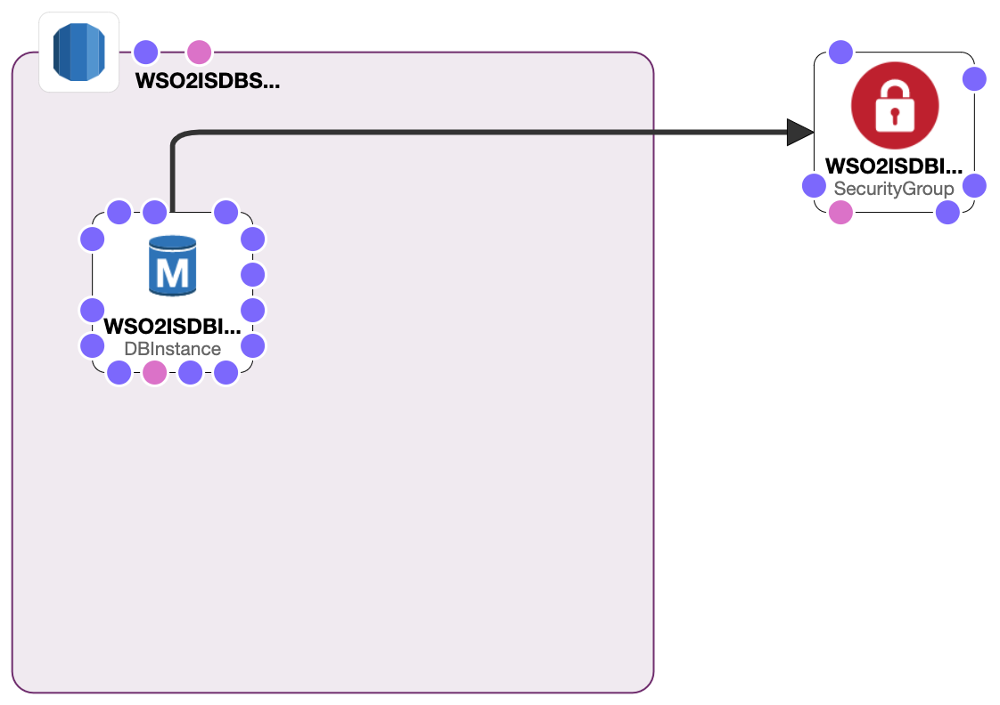

# WSO2 Identity Server High Available Deployment - Database

This is Phase two of deploying WSO2 Identity Server HA deployment. Use the [database.yaml](database.yaml) to create the required Database. The followings are the tested database versions at the moment.

```
  - MySQL-5.7
  - Postgres-9.6
  - Postgres-10.5
  - Oracle-SE1-11.2
  - Oracle-SE2-12.1
  - SQLServer-SE-13.00
  - SQLServer-SE-14.00
```

If you already have a preconfigured database, please proceed to [Phase 3](../Minimun-HA/README.md).

## Design Overview



### Estimated cost

```
$ 72.78 per month
```
The above cost is calculated to the default parameters given in the [database.yaml](database.yaml). If different inputs are chosen at the runtime, the cost may differ from the above.

## Database customizations

### Encryption

Replace the DB instance configurations in the CloudFormation if you need the Database to be encrypted.

#### [StorageEncrypted:](https://docs.aws.amazon.com/AWSCloudFormation/latest/UserGuide/aws-properties-rds-database-instance.html)

> A value that indicates whether the DB instance is encrypted. By default, it isn't encrypted.


#### [KmsKeyId:](https://docs.aws.amazon.com/AWSCloudFormation/latest/UserGuide/aws-properties-rds-database-instance.html)

> The ARN of the AWS Key Management Service (AWS KMS) master key that's used to encrypt the DB instance, such as arn:aws:kms:us-east-1:012345678910:key/abcd1234-a123-456a-a12b-a123b4cd56ef. If you enable the StorageEncrypted property but don't specify this property, AWS CloudFormation uses the default master key. If you specify this property, you must set the StorageEncrypted property to true.

```yaml
Resources:
  WSO2ISDBInstance:
    Type: 'AWS::RDS::DBInstance'
    DeletionPolicy: Delete
    Properties:
      VPCSecurityGroups:
        - !Ref WSO2ISDBInstanceSecurityGroup
      DBInstanceClass: !Ref DBInstanceType
      AllocatedStorage: !Ref DBAllocationStorage
      BackupRetentionPeriod: '0'
      DBInstanceIdentifier: WSO2ISDBInstance
      DBName: !If [UseSQLServerDB, "", WSO2ISDB]
      LicenseModel: !If [UseLicensedVersion, license-included, !Ref 'AWS::NoValue']
      EngineVersion: !Select [1, !Split ["_", !FindInMap [ DBEngineMap, !Ref DB, DBEngine]]]
      Engine: !Select [0, !Split ["_", !FindInMap [ DBEngineMap, !Ref DB, DBEngine]]]
      MasterUsername: !Ref DBUsername
      MasterUserPassword: !Ref DBPassword
      MultiAZ: 'false'
      StorageType: gp2
      StorageEncrypted: 'true'
      KmsKeyId: !Ref KmsKeyId
      DBSubnetGroupName: !Ref WSO2ISDBSubnetGroup

```

### Availability

Replace the DB instance configurations in the CloudFormation if you need multiple Availability Zone deployment for higher availability for the Database.

#### [MultiAZ:](https://docs.aws.amazon.com/AWSCloudFormation/latest/UserGuide/aws-properties-rds-database-instance.html)

> Specifies whether the database instance is a multiple Availability Zone deployment.

```yaml
Resources:
  WSO2ISDBInstance:
    Type: 'AWS::RDS::DBInstance'
    DeletionPolicy: Delete
    Properties:
      VPCSecurityGroups:
        - !Ref WSO2ISDBInstanceSecurityGroup
      DBInstanceClass: !Ref DBInstanceType
      AllocatedStorage: !Ref DBAllocationStorage
      BackupRetentionPeriod: '0'
      DBInstanceIdentifier: WSO2ISDBInstance
      DBName: !If [UseSQLServerDB, "", WSO2ISDB]
      LicenseModel: !If [UseLicensedVersion, license-included, !Ref 'AWS::NoValue']
      EngineVersion: !Select [1, !Split ["_", !FindInMap [ DBEngineMap, !Ref DB, DBEngine]]]
      Engine: !Select [0, !Split ["_", !FindInMap [ DBEngineMap, !Ref DB, DBEngine]]]
      MasterUsername: !Ref DBUsername
      MasterUserPassword: !Ref DBPassword
      MultiAZ: 'true'
      StorageType: gp2
      DBSubnetGroupName: !Ref WSO2ISDBSubnetGroup
```
