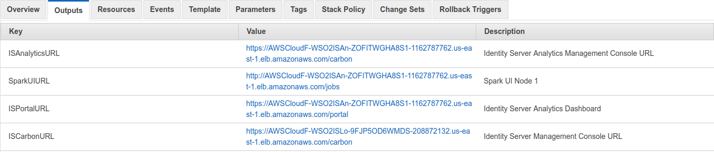

# AWS Resources for WSO2 Identity Server Configured with Analytics

## Quick Start Guide

1. Checkout this repository into your local machine using the following Git command.
```
git clone https://github.com/wso2/aws-is.git
```

2. Go to [AWS console](https://console.aws.amazon.com/ec2/v2/home#KeyPairs:sort=keyName) and specify a key value pair for authentication in a preferred region. <br>
Allowed regions are:<br>
   * ap-southeast-2 (Asia Pacific (Sydney))<br>
   * eu-west-1 (EU (Ireland))<br>
   * us-east-1 (US East (N. Virginia))<br>
   * us-east-2 (US East (Ohio))<br>
   * us-west-1 (US West (N. California))<br>
   * us-west-2 (US West (Oregon))<br>

This could be used to ssh into the instances. Add a Server Certificate to AWS using ACM or IAM as explained [here](https://docs.aws.amazon.com/IAM/latest/UserGuide/id_credentials_server-certs.html). This will be used at the load balancer listeners.

3. Go to [AWS CloudFormation console](https://console.aws.amazon.com/cloudformation/home) and select ``Launch Cloudformer``.

4. Browse to the cloned repository and select the [is-with-analytics](https://github.com/wso2/aws-is/tree/master/is-with-analytics) CloudFormation template and proceed with the deployment.

5. Follow the on screen instructions and provide the SSH key value pair name given in step 2, Server-Certificate-Name given in step 3 and other requested information and proceed.

6. Access the web UIs via the URLs available in the **Outputs** tab and login using the following credentials.
   * Username: admin <br>
   * Password: admin



**NOTE:** The services listed through above URLs may take around 15 minutes to become available, after stack creation.
