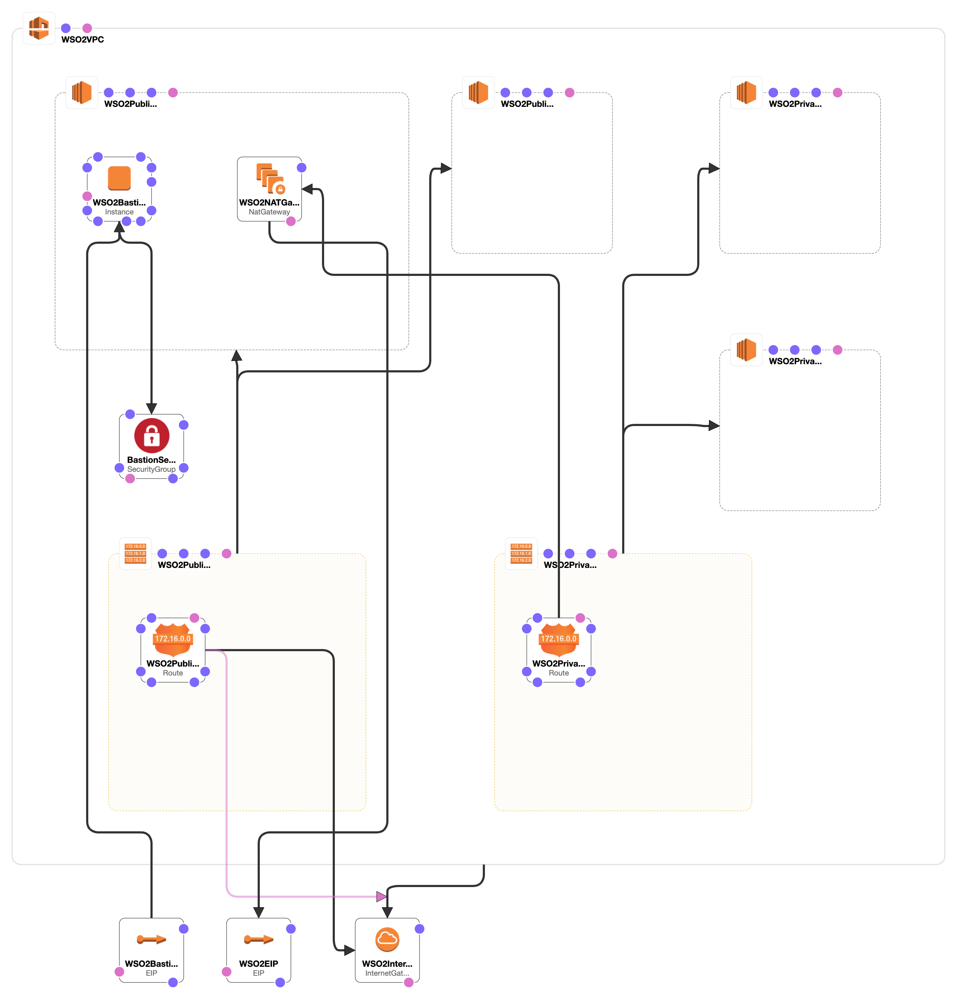

# WSO2 Identity Server High Available Deployment - Network

This is the Phase one of deploying WSO2 Identity Server HA deployment. Use the [network.yaml](network.yaml) to create the required network. If you already have a preconfigured network, please proceed to [Phase 2](../db-configs/README.md).

## Design Overview



### Estimated Cost

```
$8.50 per month
```
We recommend you to keep the Bastion Instance in the `Stop` status after the deployment. The Bastion instance can be started whenever required to log into the Product Instances.
