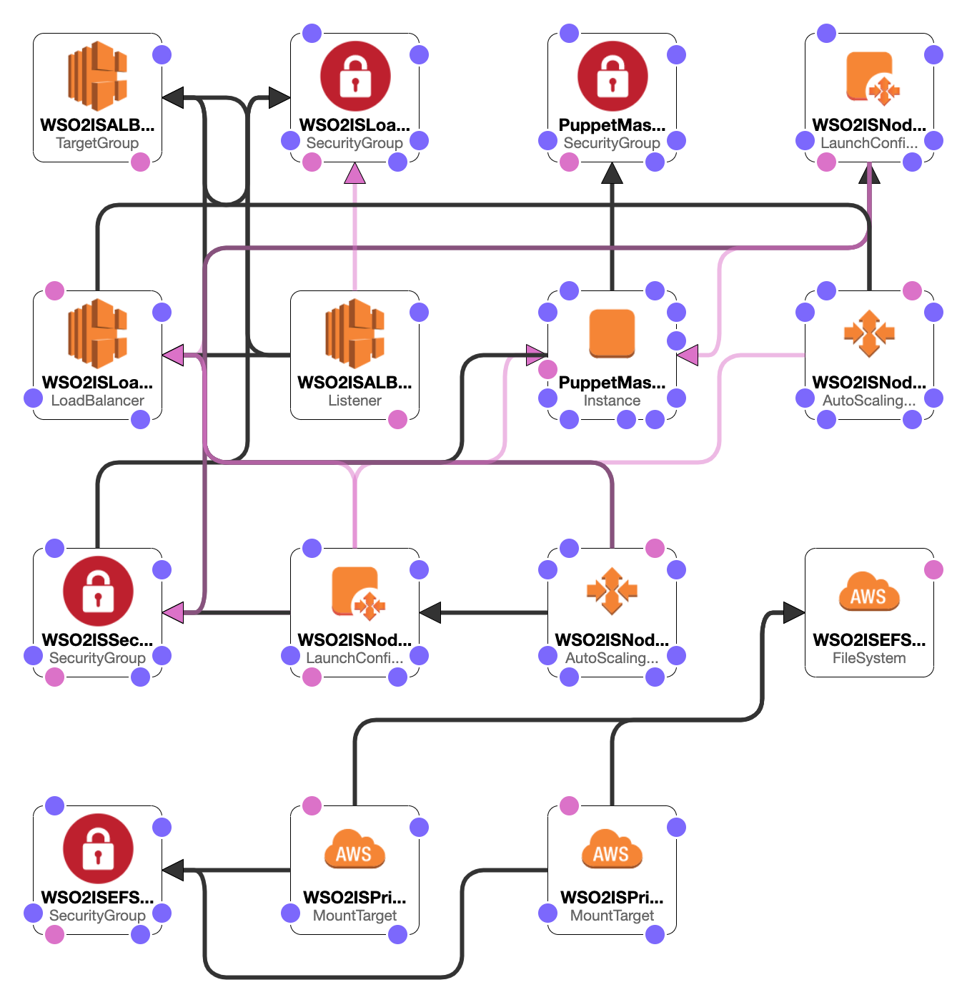
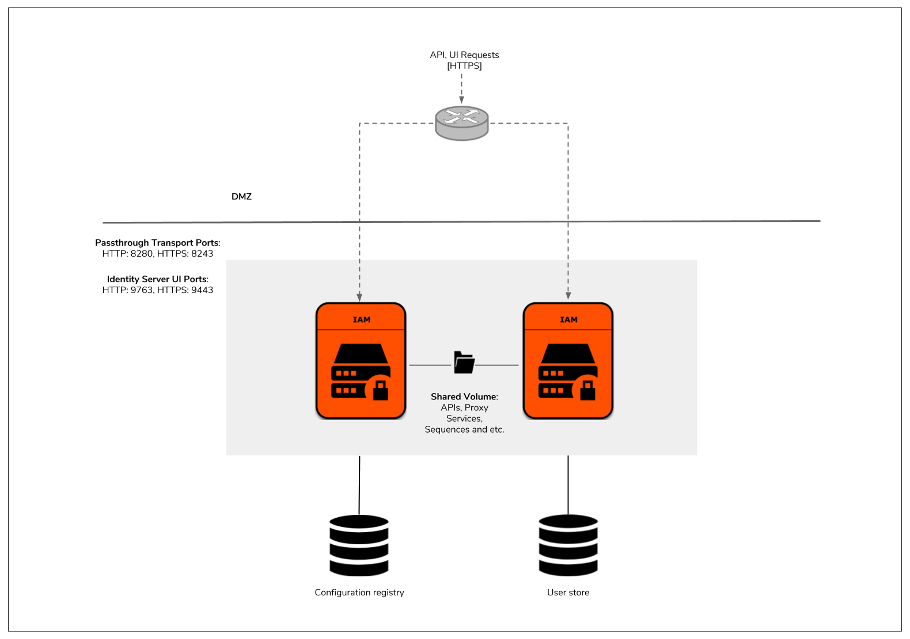

# WSO2 Identity Server High Available Deployment - Product Deployment

This is the final Phase of deploying WSO2 Identity Server HA deployment. Use the [identity.yaml](identity.yaml) to set up the deployment.


## Design Overview



The WSO2 IS CloudFormation templates use Puppet to manage the server configurations and use the following AMIs to provision the deployment.

1. Puppetmaster AMI - Contains the Identity Server GA distribution, WSO2 Update Manager, and Puppet modules containing the configurations for IS deployment patterns.

2. IS AMI - Contains the scripts that are required to create the Puppet catalog. Also, these AMIs contain the OS hardening recommended by WSO2. When EC2 instances start using the AMIs, the instances are updated to get the latest OS updates.

### Order of execution

1. Puppetmaster
     - The latest OS updates and the required tools such as AWS CLI, Logstash, JDK are installed in the Puppetmaster.
     - The scripts needed to add the latest updates to the WSO2 products are retrieved.
     - The latest updates for WSO2 servers are added to the residing GA WSO2 servers in the AMI.
     - Relevant configurations(IP addresses, DB URLs, etc.) are done to the puppet modules.
     - DB scripts are executed against the DB created in [Phase 2](../db-configs/README.md).

2. Identity Server(Puppet agent)
     - The latest OS updates and the required tools such as puppet-agent, AWS CLI, Logstash, JDK are installed in the puppet agent.
     - Puppet modules are retrieved from the Puppetmaster and the product is installed.
     - The directories should be persisted are mounted to an EFS.
     - WSO2 servers are started

### Estimated Cost

```
$101.92 per month
```
The above cost is calculated to the default parameters given in the [identity.yaml](identity.yaml). If different inputs are chosen at the runtime, the cost may differ from the above.

## Scalable IS


